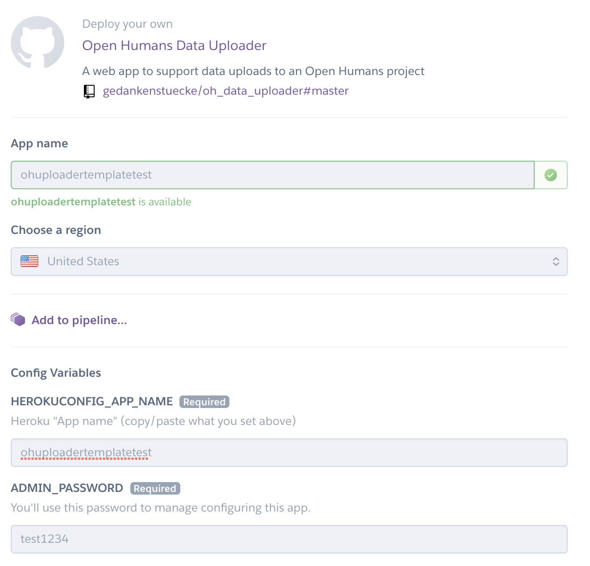
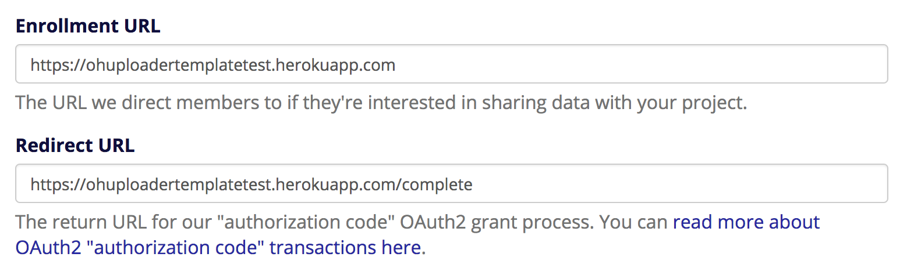
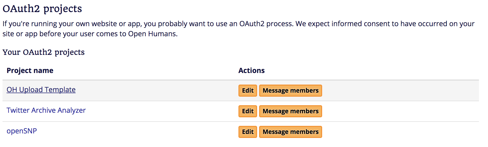
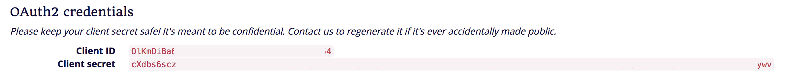
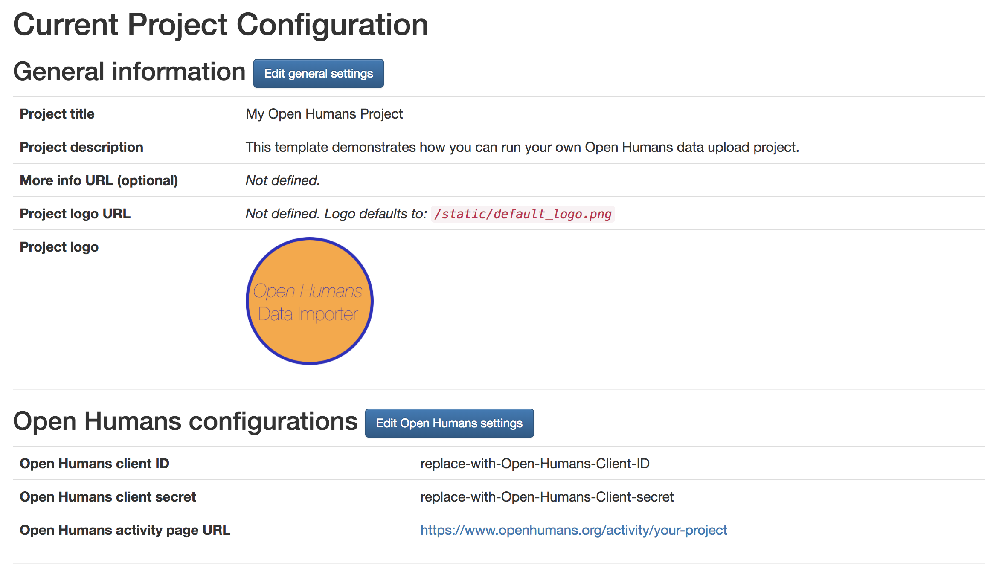

# Open Humans Uploader
> it's like *Jekyll* for *Open Humans* projects

[](https://heroku.com/deploy)

This is a Django project that functions as a
file uploader for individual *Open Humans* projects. It can easily be deployed to
*heroku* and all the configuration can be done through your web browser once the project is deployed. A step-by-step guide can be found below

## Deployment to *heroku*.

This is a 5-Step guide to get your own Open Humans data upload project up and running. It does not require neither programming nor command line experience.

### **Step 1**: Click the *deploy to heroku* button above.

Log in into your existing *heroku* account or create a new one. (This Uploader is designed to completely work with the free tier of *heroku*, so you don't have to give them any payment details).

### **Step 2**: Fill out the parameters that *heroku* asks you

(see screenshot below).



*heroku* asks you to give your app a name, for this demo we use `ohuploadertemplatetest`. Repeat this name below for the `HEROKUCONFIG_APP_NAME`. The second important parameter is the `ADMIN_PASSWORD`. You will later need this to connect your uploader to *Open Humans* and to customize your uploader. Onxe you have entered this information you click on *deploy app* and after a while you should get a success message.

Now your uploader should be available at `https://ohuploadertemplatetest.herokuapp.com/`.

### **Step 3**: Create your project on *Open Humans*

On *Open Humans* you can create a new project by [clicking on *create a new OAuth2 data request project*](https://www.openhumans.org/direct-sharing/projects/manage/).



Fill out the form and enter all the required information. The most important to make sure that your uploader will work is the *Redirect URL*, which will be set depending on your *App name*. If your app's main page is `https://ohuploadertemplatetest.herokuapp.com/`, then the `REDIRECT URL` should be `https://ohuploadertemplatetest.herokuapp.com/complete`.

### **Step 4**: Grab your Oauth credentials from *Open Humans*

Once you click on save in **Step 3** you should come back to the list of all projects you are currently running. This should now contain your new project.



Click on the name of your new project and this new page you will see your `CLIENT ID` and `CLIENT SECRET`. This are the two missing bits of information that you will need to connect your new *heroku* Uploader app to *Open Humans*.



### **Step 5**: Finalize your Uploader setup

You can now go to `https://ohuploadertemplatetest.herokuapp.com/project-admin/login` and use the `ADMIN_PASSWORD` you gave in *Step 2* to log in.



Once logged in you will see a page that gives you all options to edit your template and make it work for your own project. As a most important, first step you should start by clicking `Edit Open Humans settings`. Here you can enter the `CLIENT ID` and `CLIENT SECRET` that you looked up in *Step 4*. Afterwards you can edit more things about your project like:
- the Title & Description
- the metadata used for the uploaded files
- all the texts that should appear on your uploader website.

This last bit is done [by writing Markdown formatted text right into the forms](https://help.github.com/articles/basic-writing-and-formatting-syntax/).

## Local Deployment and Development
The *Open Humans Uploader* is written in *Python 3.6+*, uses the *Django 2.0* framework and is designed to be ultimately deployed
to *Heroku*. You will need some additional modules and packages to locally experiment with this uploader template or to develop it further.

Below is a the step-by-step guide that should work for Mac OS and with minor differences for Linux.

 *Step 1: Install Anaconda and needed packages*

[Download & Install the appropriate version of *Anaconda* on your end](https://www.anaconda.com/download/#macos),
this makes it easy to keep Python versions and modules clean. If you are already familiar with [*virtualenv*](https://virtualenv.pypa.io/en/stable/) you can use their workflow instead of *Anaconda*.

After you have installed *Anaconda*, create a fresh environment for the *Open Humans uploader* and activate it:

```
conda create -n oh_uploader python=3.6
source activate oh_uploader
```

Now you can install the packages needed to locally run the `oh_data_uploader` by navigating into the
directory of the `oh_data_uploader` and running pip:

```
cd oh_data_uploader/
pip install -r requirements.txt
```

*Step 2: Install Heroku Command Line Interface (CLI)*

You should install the Heroku CLI to run this app locally.
Heroku has [installation instructions for MacOS, Windows, and Linux](https://devcenter.heroku.com/articles/heroku-cli#download-and-install).

If you are running MacOS the easiest way to do this is using [Homebrew](https://brew.sh/). After installing Homebrew you can do:

```
brew install heroku
```

Once this is done you can complete minimal setup by:
* Create an `.env` file from the example: `cp .env.sample .env`)
* Edit `.env` to set a random string for `DJANGO_SECRET`
* Migrate your database using `heroku local:run python manage.py migrate`
* Initialize config with `heroku local:run python manage.py init_proj_config`

Now you can run the webserver of your local heroku environment using `heroku local`.

To fully set up your uploader you will have to modify some files, as described below.

## Configuration

### Setting up a project on *Open Humans*
To connect this data uploader to your own *Open Humans* project you should start out by
[creating a new project on Open Humans](https://www.openhumans.org/direct-sharing/projects/manage/).
Select the *Create a new OAuth2 data request project* button and fill out the form.

For this uploader to work you have to give the correct redirect URL in the form (it's the last field).
Our uploader expects redirects to `youraddress.com/complete`. If you run this tool on your development
machine it will probably be `http://127.0.0.1:5000/complete`. If you deploy it to *heroku* it will be
`https://yourappname.herokuapp.com/complete`.

### Configure the *Open Humans Uploader*

This configuration is done by two means:
1. The `config.yaml` file contains information that will be displayed on your website later on. As such it is not sensitive and can be publicly available.
2. For sensitive information there is the `.env` file that contains your **secret** information that you need to connect to your database and *Open Humans*. This file should not be available online! An example file can be found in `.env.sample`.

#### The `config.yaml`

This file contain a number of details. First of all are the metadata that will decide on the style of the main page, how your project will be called throughout the application etc.

```
# REQUIRED: What's the name of your project?
project_title: My Open Humans Project
# REQUIRED: Will be displayed on the front page of the uploader
project_description: This template demonstrates how you can run your own Open Humans data upload project.
# REQUIRED: Where can we find your project on Open Humans
oh_activity_page: https://www.openhumans.org/activity/your-project-url/
```

The `app_base_url` tells the *Open Humans Uploader* where it will be located. It's
important to get this right. Amongst other things this will also decide on what the `REDIRECT URL` is.
For your local development you can keep `http://127.0.0.1:5000`. If you deploy to *heroku* you might
want to change this.

```
# REQUIRED: which URL will lead to your Open Humans uploader
app_base_url: http://127.0.0.1:5000
```

Files that are uploaded to *Open Humans* require metadata that describe the files
along with some tags. These two parameters set the metadata for your uploads:

```
# REQUIRED: Tell Open Humans what kind of data is being uploaded
file_description: This is an example file that doesnt have any meaning.
# REQUIRED: Tags to add to your file uploads
file_tags:
- tags
- 'are a good way to'
- 'describe the files you are uploading'
```

Optionally you can also specify your own logo for your project. It will be displayed
prominently on the front page.

```
# Give the path to the logo of your project.
logo: ' static/default_logo.png'

# Is there a larger project website where more info might be located?
more_info_link: http://www.github.com/gedankenstuecke/oh_data_uploader
```

#### The `.env` file
In addition to the public parameters you will need to set the parameters that control the API
connection to *Open Humans* and your database. For your development environment these parameters
can be set in the `.env` file (an example is provided in `.env.sample`):

```
DATABASE_URL=postgres:///myurl
SECRET_KEY=mysecretshouldnotbeongit
OH_CLIENT_ID=myclientidshouldnotbeongit
OH_CLIENT_SECRET=myclientsecretshouldnotbeongit
```

The `DATABASE_URL` tells your uploader to which database it should connect, while the `SECRET_KEY` is used
to keep your uploader itself safe. The `OH_CLIENT_ID` and `OH_CLIENT_SECRET` are used for the communication with
*Open Humans*. You can find both on your project site, by [clicking on the name of your project here](https://www.openhumans.org/direct-sharing/projects/manage/).

If you deploy your application to *heroku* you will not use the `.env` for the parameters, rather you will use the [config variables as described by Heroku](https://devcenter.heroku.com/articles/config-vars).


## Deploy to *Heroku*
The *Open Humans Data Uploader*  
